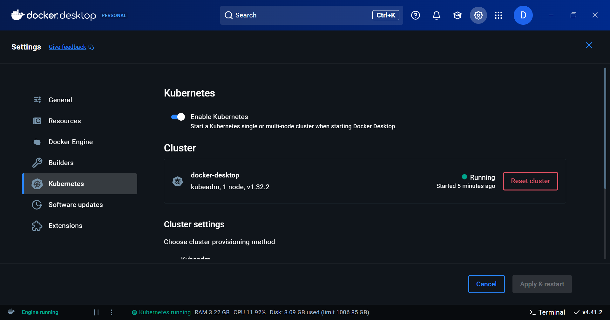
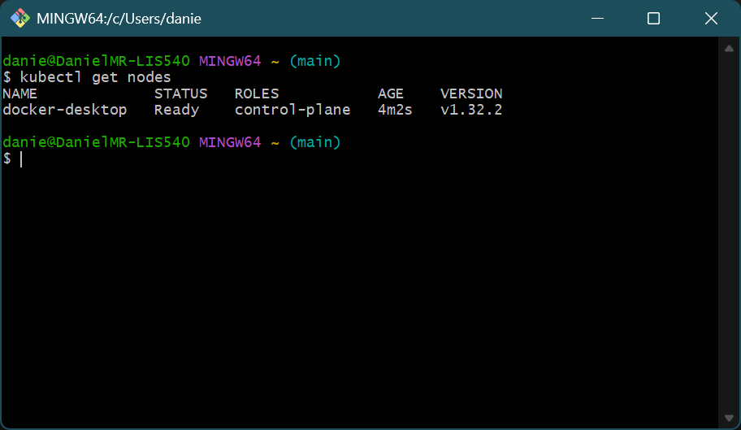
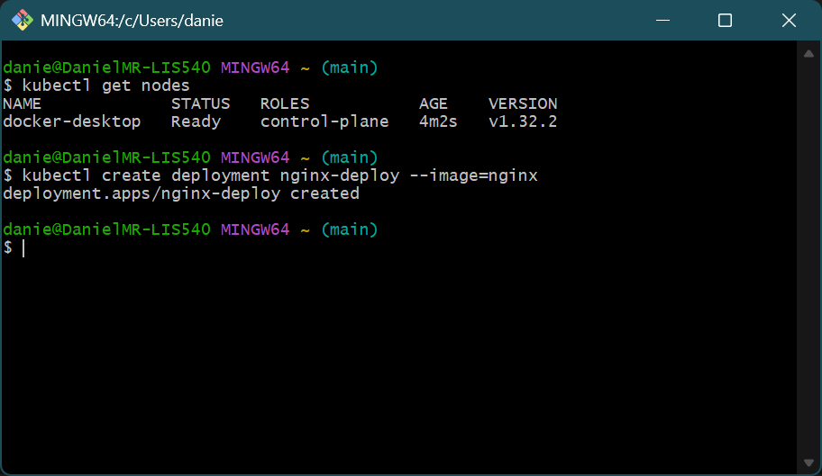
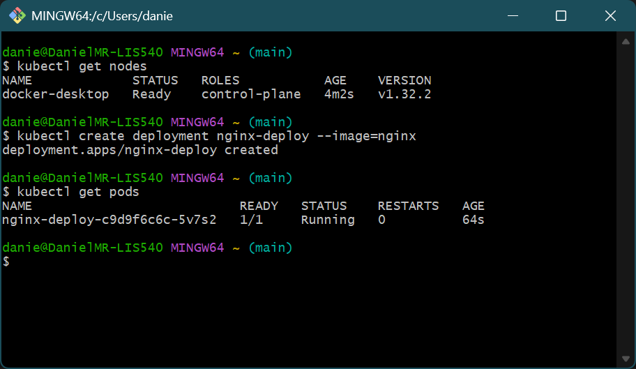
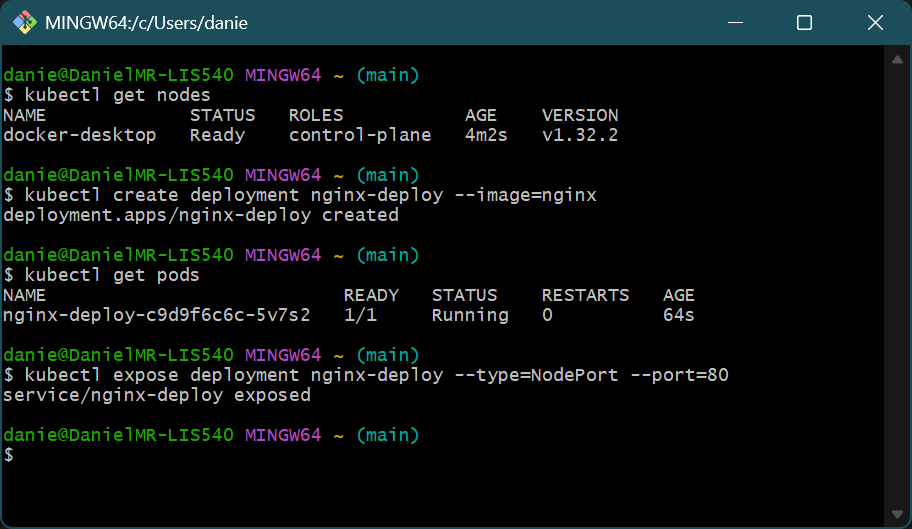
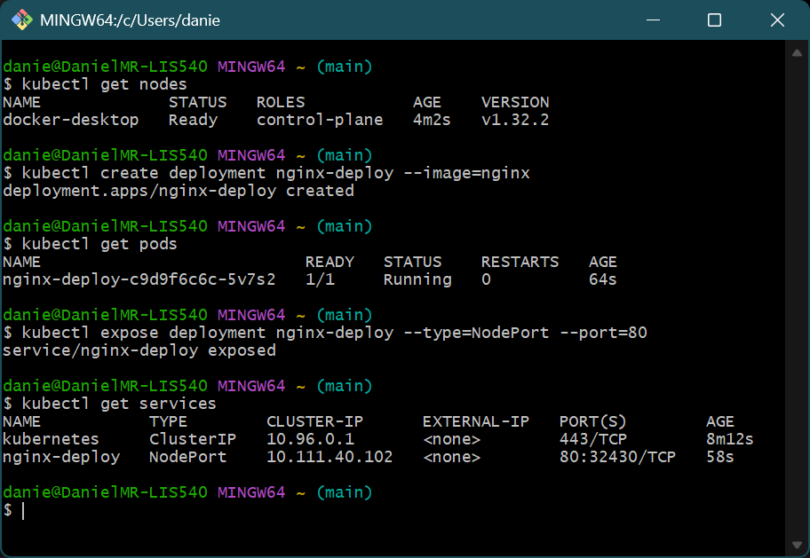
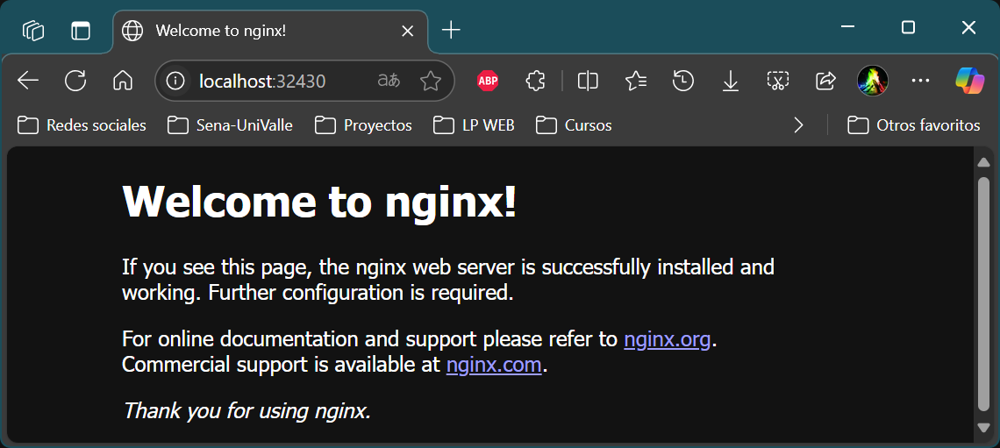
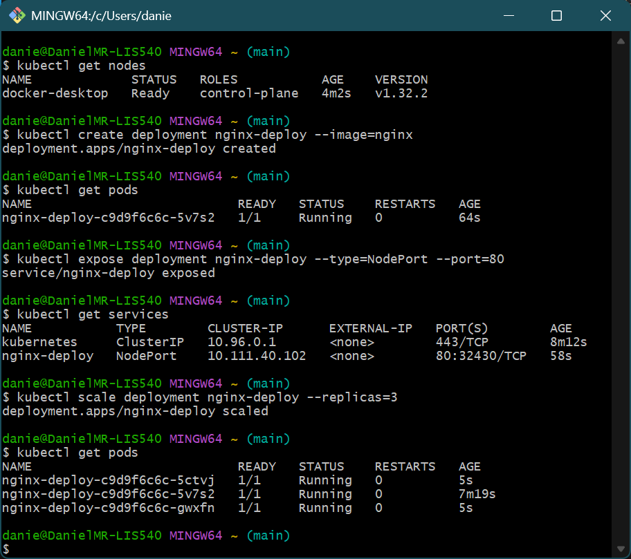

# Introducción a la Práctica de Kubernetes

En esta guía aprenderás paso a paso cómo desplegar y gestionar una aplicación en Kubernetes. Se usarán imágenes ilustrativas para comprender cada proceso.

## Preparación del entorno

En esta sección se configura el entorno necesario para comenzar a trabajar con Kubernetes.

  
*Minikube iniciado correctamente.*

  
*Verificación de que el clúster está funcionando.*

## Desplegando la primera aplicación

Ahora se crea y despliega la primera aplicación en Kubernetes utilizando un deployment.

  
*Se define el archivo de configuración del deployment.*

  
*Aplicación desplegada correctamente con `kubectl apply`.*

  
*Se verifican los pods en ejecución.*

  
*Se comprueba que el servicio está creado y funcionando.*

### Accediendo desde el navegador

El siguiente paso es abrir la aplicación en el navegador utilizando la URL proporcionada por Minikube o el servicio NodePort.

  
*La aplicación se muestra correctamente en el navegador.*

### Escalando la aplicación

Se aumenta la cantidad de réplicas para escalar horizontalmente la aplicación.

- Se aumenta el número de réplicas a 3 con el siguiente comando:

