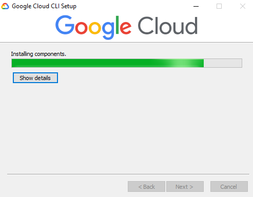
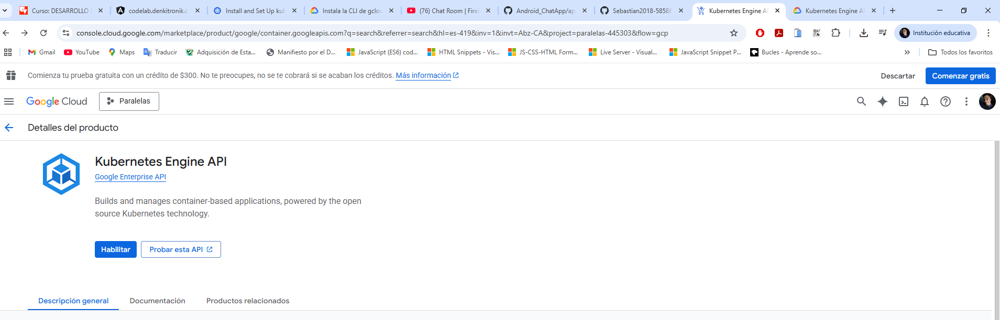
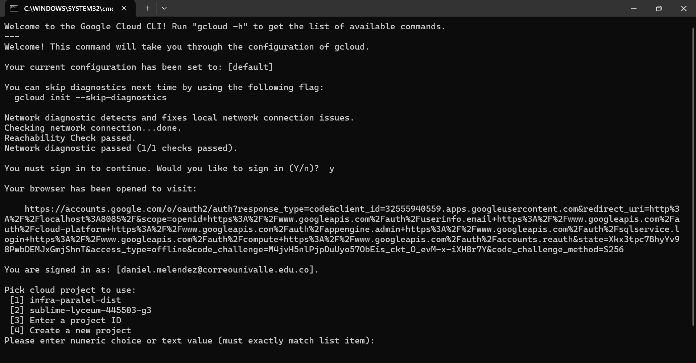

# CODELAB: KUBERNETES NIVEL BASICO - GCP

- **Iniciar cloud**  
  

- **Habilitar**  
  

- **Verificar** 
  

- **Ginit**  
  

 **NOTA/AVISO: Faltó continuar con el proceso pero no es posible realizarlo ya que se necesita una cuenta de cobro y tener una tarjeta de credito**  

