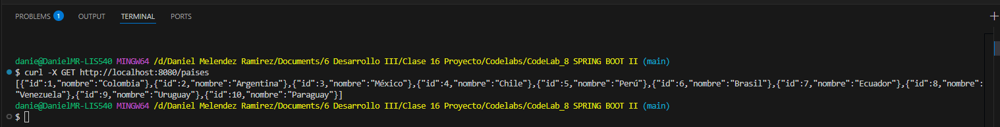
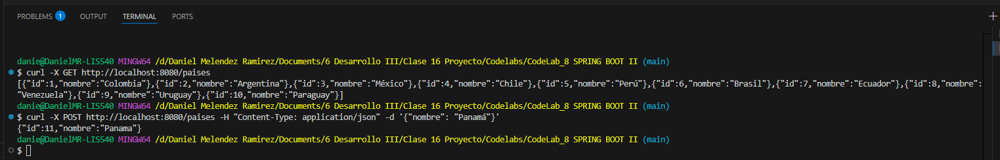
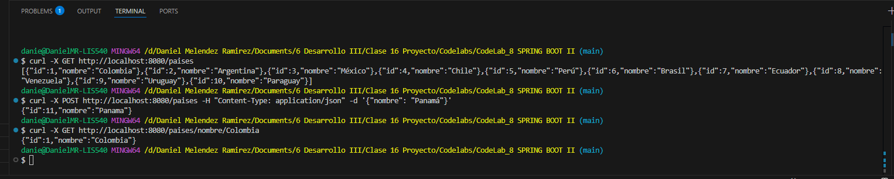
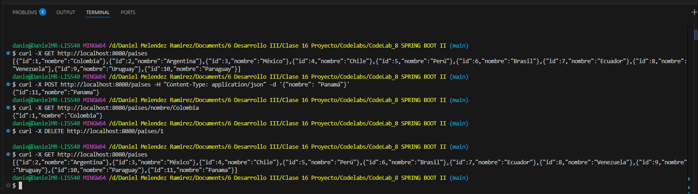

# Evidencias del codelab # 8 Spring Boot II

- **Consulta todos los paises**  
  

- **Inserción**  
  

- **Consulta pais por nombre**
  

- **Eliminar un pais por id**  
  

- **Solución del presente codelab**

# Respuestas a las preguntas del codelab # 8 Spring Boot II
1. *¿Cuál es el propósito de Spring Boot y por qué es útil en el desarrollo de aplicaciones Java?*
Spring Boot simplifica el desarrollo de aplicaciones Java al eliminar la necesidad de configuraciones manuales extensas. Permite crear aplicaciones web o REST rápidamente, integrando automáticamente dependencias comunes y ofreciendo un servidor embebido listo para ejecutar.

2. *¿Cómo se configura una base de datos PostgreSQL en un proyecto Spring Boot usando application.properties?*
Se especifican propiedades como la URL de conexión, usuario, contraseña y el dialecto de Hibernate. Por ejemplo: spring.datasource.url=jdbc:postgresql://localhost:5432/mi_basedatos, junto con spring.jpa.hibernate.ddl-auto=update para manejar el esquema automáticamente.

3. *¿Qué hace la anotación @Entity en la clase Pais y por qué es necesaria?*
La anotación @Entity indica que la clase representa una tabla en la base de datos. Es esencial para que Hibernate pueda mapear la clase Pais a la tabla correspondiente y gestionar su persistencia.

4. *¿Cuál es la función de JpaRepository y por qué se usa en la capa de persistencia?*
JpaRepository proporciona métodos CRUD listos para usar y consultas personalizadas. Permite interactuar con la base de datos sin escribir SQL, simplificando la lógica de persistencia en Spring.

5. *¿Cómo se implementa la inyección de dependencias en el servicio PaisService y por qué es importante?*
Se implementa usando el constructor, pasando el PaisRepository como parámetro. Esto favorece el desacoplamiento y facilita pruebas, mantenimiento y reutilización del código.

6. *¿Cuál es la diferencia entre @RestController y @Service en Spring Boot?*
@RestController define una clase que gestiona peticiones HTTP y devuelve respuestas JSON. @Service marca una clase que contiene lógica de negocio, normalmente usada por los controladores.

7. *¿Cómo se define un endpoint en un controlador REST para buscar un país por su nombre?*
Se usa @GetMapping("/nombre/{nombre}") junto con @PathVariable para capturar el nombre desde la URL, y luego se invoca un método del servicio que realiza la búsqueda.

8. *¿Por qué es útil Docker para ejecutar PostgreSQL en lugar de instalarlo manualmente?*
Docker permite ejecutar PostgreSQL en un contenedor aislado, sin necesidad de instalación local. Facilita la portabilidad, configuración rápida y evita conflictos entre versiones.

9. *¿Cómo se ejecuta y prueba la API REST en IntelliJ IDEA?*
Se ejecuta la clase principal con @SpringBootApplication, y luego se prueban los endpoints usando herramientas como curl, Postman o el navegador, accediendo a http://localhost:8080.

10. *¿Cómo se maneja la eliminación de un país en el API y qué código de respuesta devuelve el servidor?*
Se define un método con @DeleteMapping("/{id}") que elimina el país por su ID. El servidor responde con el código 204 No Content si la eliminación es exitosa.